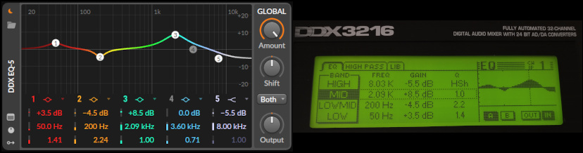
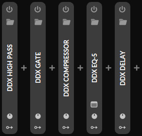

Be an Uli and use Bitwig like a pro with the Behringer DDX3216 controller script!

### Highlights

* Exact dB fader mapping! -10dB in Bitwig is -10dB on the DDX3216 and so on.
* High fader resolution of 1427 steps via SysEx.
* Bidirectional behaviour. Your motor faders will dance! Changes in Bitwig reflect on the DDX3216 vice versa.
* Insert strip. Channel-wise control of HighPass, Gate, Compressor, EQ and Delay in both direcions!
* Aux sends and FX busses mapped.
* Toggle Bitwig groups.

### Features

* Volume faders on 1-48
* Effect track faders on 49-56 by selecting the AUX/FX page, reflecting the Bitwig FX tracks.
* Channels 57-64 can be used as a spare for something else.
* Master fader
* Panning on 1-32 and the master
* Mutes on all channels except master
* 8 sends on each channel by pressing the AUX1-4/FX1-4 buttons reflecting the Bitwig sends.
* Toggle pre and post mode for sends.
* All DDX insert effects are mapped to the respective Bitwig equivalents. It works unidirectional. You can control those effects with the DXX or control the DDX with adjusting the effects in Bitwig. Isn't that fantastic?
  HighPass (EQ-2), Gate (Gate), Compressor (Compressor), EQ (EQ-5), Phase/Delay (Delay-1 with custom phase setting).
* Select a channel in Bitwig by pressing SELECT -> ROUTING -> MAIN (the select button itself does not receive/send any SysEx/CC)
* Open/close a group in Bitwig also by pressing SELECT -> ROUTING -> MAIN. The MAIN icon indicates the group status.

### Configuration

* Set the MIDI channel in the controller script config dialog in Bitwig. 0 = omni
* Fader dB mapping behaviour is selectable between "exact" or "full range" in the config dialog. default = "exact"

### Installation

1. Simply copy the the sub-folders of this project's `Bitwig Studio` folder into your own Bitwig `~/Bitwig Studio/` folder. It includes the controller script and a project template with the channel inserts ready for use.
2. Add the controller script in Bitwig by choosing "Behringer -> DDX3216" in `Settings` and `Controller`.
3. Select the appropriate MIDI ports in the config dialog and also check/adjust the MIDI channel.
4. On the DDX3216 check for matching MIDI channels by pressing MMC/MIDI -> SETUP -> Transmit/Receive Channel.
5. On the DDX3216 check if `Direct Parameter SysEx` is enabled by pressing MMC/MIDI -> SETUP -> RX/TX.
6. Create a new Bitwig project by openening the template "DDX3216" and copy the channel strip effects from one of the tracks into your own project or simple use the freshly created project as a starting point.

### Effects 

To map a Bitwig effect to the related DDX3216 insert effect, you need to rename the Bitwig effect to a specfic name or __just load the "DDX3216" Bitwig template__ you added during installation, where you find everything prepared for direct usage or copy&paste.

Bitwig name -> Effect name:
* EQ-2 -> DDX HIGH PASS
* Gate -> DDX GATE
* Compressor -> DDX COMPRESSOR
* EQ-5 -> DDX EQ-5
* Delay-1 -> DDX Delay-1 (use the one from the template as this has a polarity invertion option)

### Good to know

Turn on the DDX first and then start Bitwig, otherwise the initial DDX fader settings will be applied on your entire Bitwig project.
But don't panic, if this happens, just go one step back in history by pressing CMD/CTRL+Z on your keyboard in Bitwig and everything is fine and synced!

### Not so nice, but also not deadly.

* Effect tracks embedded in groups are not accessible due to Bitwig's API behaviour.
* No solo buttons: The DDX3216 has no SysEx or CC implementation for the solo buttons, so they simply do not work.
* No pan at bus, aux and FX faders: Faders 33-64 are not panable, due to the lack of SysEx or CC commands. Did they ran out of memory or what?

### Support me

If you enjoy the script, please purchase my music album on Bandcamp. It's also released on tape as cassette!
[AldiPower on Bandcamp](https://aldipower.bandcamp.com/album/das-reihenhaus)
Thank you so much.

### Contribute & Bugs

This script is tested against Bitwig 5.3.13.

Create an issue or better a PR here on [GitHub](https://github.com/aldipower/bitwig-ddx3216-controller/issues), if you have something to fix or add.

### Credits & Disclaimer

Thanks to the guys of [Typed Bitwig Api](https://github.com/joslarson/typed-bitwig-api), especially [Joseph Larson](https://github.com/joslarson), who made it possible to access the Bitwig API via TypeScript. Fantastic!

I am not working for Behringer nor did I wrote this script for commercial interests. I am not liable if your motor faders start to burn.
